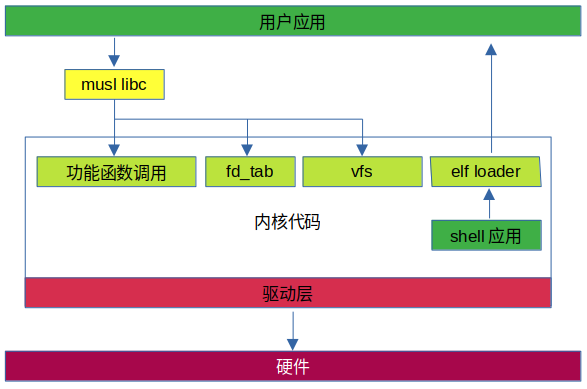
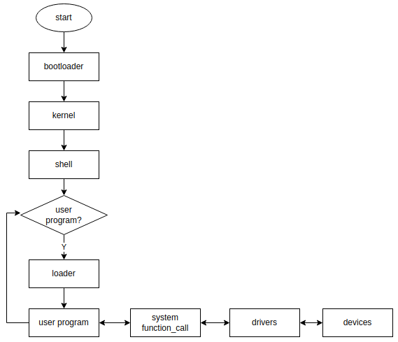

# openChaos 操作系统介绍

“杀鸡焉用宰牛刀” —— 《论语·阳货》

***以下是对 `openChao` 操作系统的初步构思。***

## 系统设计目标

+ 兼容 `posix` 程序；
+ 使用 `RUST` 编程语言；
+ 支持线程的实时调度；
+ 使用系统函数调用替代系统调用；
+ 不区分内核态和用户态，统一工作在内核空间；
+ 不支持多进程，只支持多线程；
+ 用户程序采用静态链接方式，不支持动态库；
+ 用户程序采用动态加载的方式，用户程序与操作系统可以各自独立开发；

## 系统框图

+ 将 `musl libc` 库的系统调用改造成系统函数调用；
+ 用户应用通过 `musl libc` 与内核进行交互；
+ 内核提供：
  + `open` 、`write` 等功能：实现 `Linux` 的系统调用的部分功能，是 `Linux` 系统调用的子集；
  + 简化的 `fd table` ：`fd_tab` 是一个简化版的文件描述符管理器，用于兼容 `posix` 规范；
  + `elf` 加载器：用于动态加载用户的程序；
  +  `shell` 终端程序：用于动态加载用户的代码，使得系统和用户程序可以分别开发、相互隔离；
  + `vfs` 虚拟文件系统：`vfs` 支持的文件系统用来保存用户的程序， 以便通过 `shell` 调用 `elf loader` 加载来加载用户程序；
  + 硬件驱动框架：未定；
+ 内核通过硬件驱动层与硬件进行交互；

## 系统流程

+ 系统上电后，通过 `bootloader` 加载内核程序；
+ 内核代码中内置 `shell` 程序，在内核加载完成后会自动跳转到该 `shell` 程序并执行；
+ 用户可以在 `shell` 界面中选择要执行的程序，并通过 `elf loader` 将用户程序加载到运行位置，并开始执行；
+ 由于本系统不支持多进程，所以在加载完用户程序后会将执行权限完全交给用户程序，即用户程序和 `shell` 程序不可以同时运行，也就是用户程序不可以通过 `shell` 脚本或者 `system()` 函数来实现一些功能；
+ 在用户程序退出后，系统会自动调用 `shell` 程序，跳回到 `shell` 界面；